МИНИСТЕРСТВО НАУКИ  И ВЫСШЕГО ОБРАЗОВАНИЯ РОССИЙСКОЙ ФЕДЕРАЦИИ  
Федеральное государственное автономное образовательное учреждение высшего образования  
"КРЫМСКИЙ ФЕДЕРАЛЬНЫЙ УНИВЕРСИТЕТ им. В. И. ВЕРНАДСКОГО"  
ФИЗИКО-ТЕХНИЧЕСКИЙ ИНСТИТУТ  
Кафедра компьютерной инженерии и моделирования
<br/><br/>

### Отчёт по лабораторной работе № 1<br/> по дисциплине "Программирование"
<br/>

студента 1 курса группы ПИ-192(2)  
Ярош Никиты Валерьевича 
направления подготовки 09.03.04 "Программная инженерия"  
<br/>

<table>
<tr><td>Научный руководитель<br/> старший преподаватель кафедры<br/> компьютерной инженерии и моделирования</td>
<td>(оценка)</td>
<td>Чабанов В.В.</td>
</tr>
</table>
<br/><br/>

Симферополь, 2019


# Изучение базовых возможностей MS Visual Studio

## Цель: 
изучить основные возможности создания и отладки программ в IDE MS Visual Studio

## Ход работы

## 1. Как создать консольное приложение C++;

Для начала откроем MS Visual Studio и выберем панель **"Создание проекта"**:

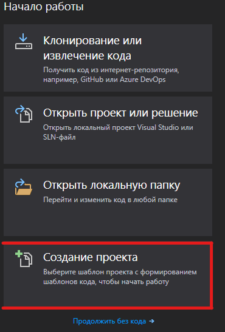

>Рисунок.1 Создание проекта

Затем выбираем **"Консольное приложение"** и нажимаем на кнопку **"Далее"**:

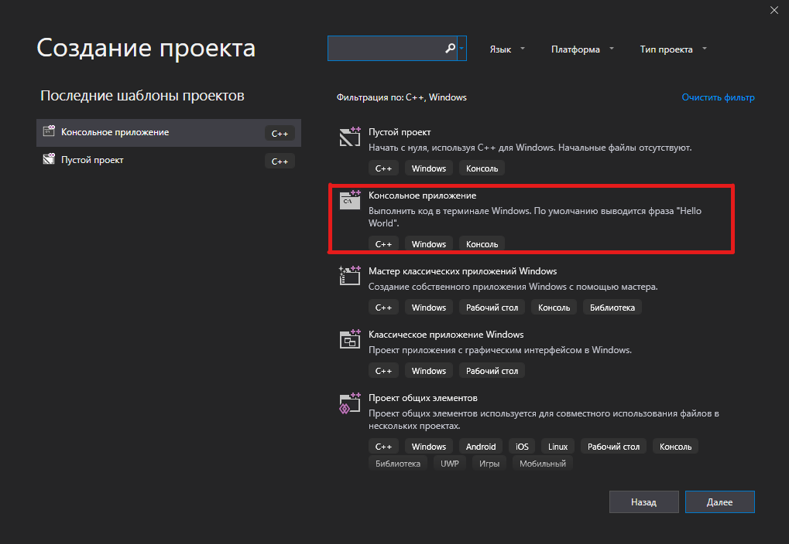

>Рисунок.2 Создание проекта, консольное приложение

После этого выбираем имя проекту и его расположение, после этого нажимаем на конпку **"Создать"**:

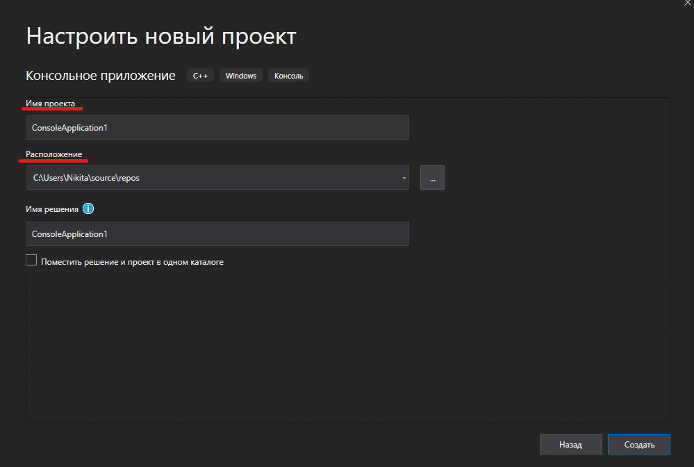

>Рисунок.3 Выбор имени и расоложения проекта

В результате вы получите: 

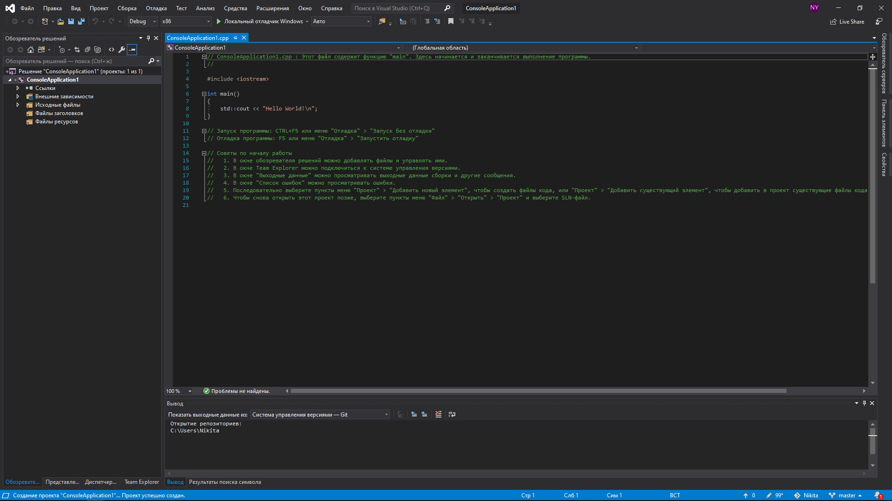

>Рисунок.4 Созданное консольное приложение в VS

## 2. Как изменить цветовую схему (оформление) среды;

Вверху на панеле выбираем вкладку **"Средства"**, затем в открывшемся окне **"Параметры"**:

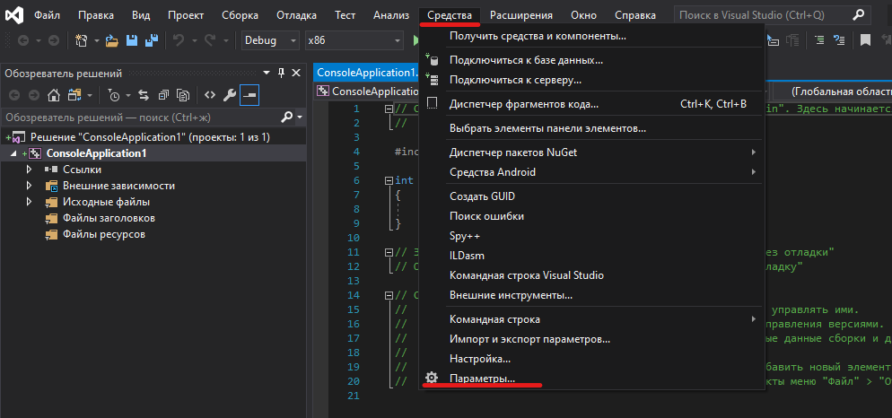

>Рисунок.5 Открытие окна параметров

В окне параметров выбираем раздел **"Окружения -> Общие"** и справа вам предложат выбрать цветовую тему:

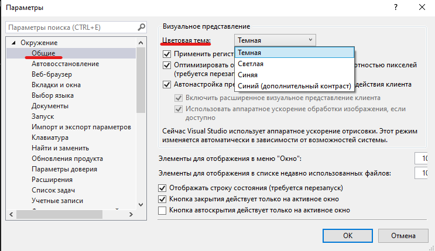

>Рисунок.6 Выбор цветовой схемы VS

## 3. Как закомментировать/раскомментировать блок кода средствами VS;

Для этого в VS можно использовать сочетания клавиш **"Ctrl+K, Ctrl+C"**, чтобы закомментировать и сочетания клавиш **"Ctrl+K, Ctrl+U"**, чтобы раскомментировать:

## 4. Как открыть в проводнике Windows папку с проектом средствами VS;

Для этого в VS существует простая комбинация клавиш **"Ctrl+Shift+O"**:

## 5. Какое расширение файла-проекта используется в VS;

Файл-проекта использует расширение **.vcxproj**:


>Рисунок.7 Расширение файла-проекта

## 6. Как запустить код без отладки (не менее 2 способов);

1 способ: Выбираем вверху на панеле вкладку **"Отладка"**, затем в открывшемся окне **"Запуск без отладки"**:
		
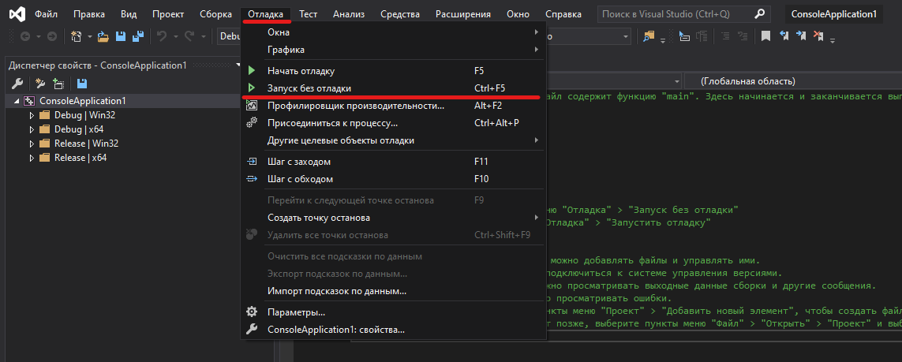

>Рисунок.8 Запуск кода без отладки

2 способ: Для запуска кода используем сочетание клавиш **"Ctrl+F5"**;

## 7. Как запустить код в режиме отладки (не менее 2 способов);

1 способ: Выбираем вверху на панеле вкладку **"Отладка"**, затем в открывшемся окне **"Начать оладку"**:

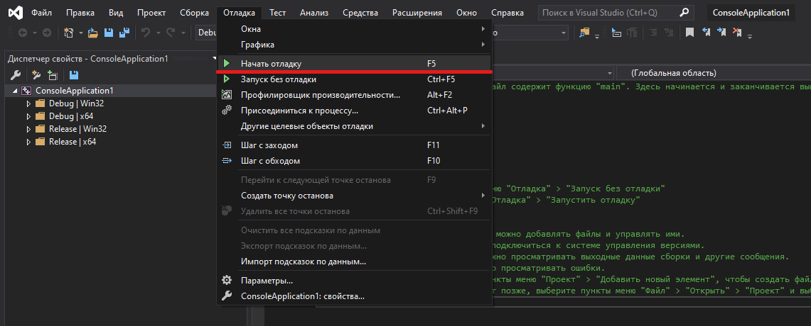

>Рисунок.9 Запуск отладки кода

2 способ: Для запуска отладки используем клавишу **"F5"**;

## 8. Как установить/убрать точку останова (breakpoint);

Для того, чтобы установить или убрать точки останова, нужно выбрать нужную строку и нажать клавишу **"F9"** или нажать правой кнопкой мыши(ПКМ) по нужной строке и в открывшемся окне выбрать **"Точка останова -> Вставить точку останова"**:

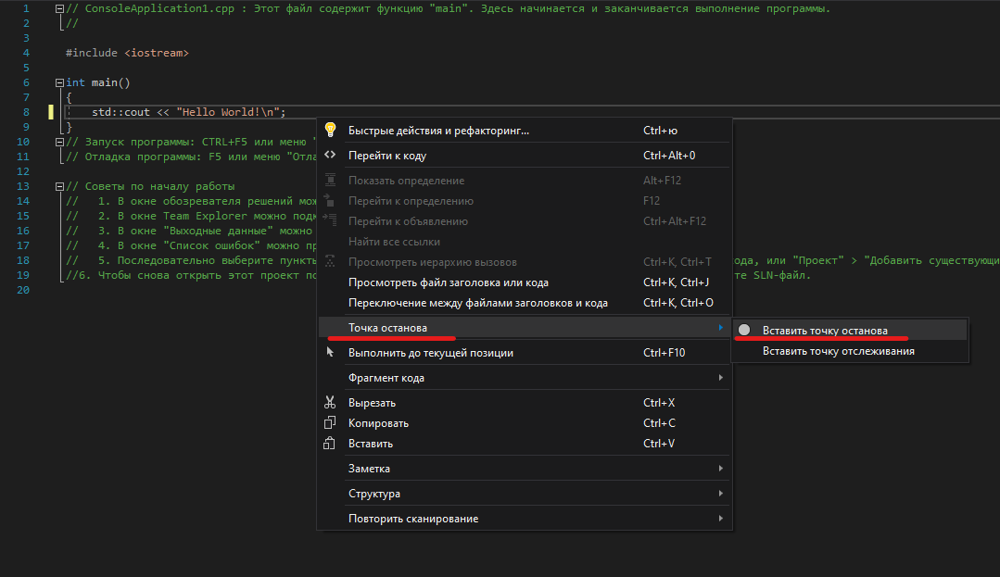

>Рисунок.10 Создание точки останова

Чтобы удалить точку установа, совершаем такие же действия: **"Точка останова -> Удалить точку останова"**:

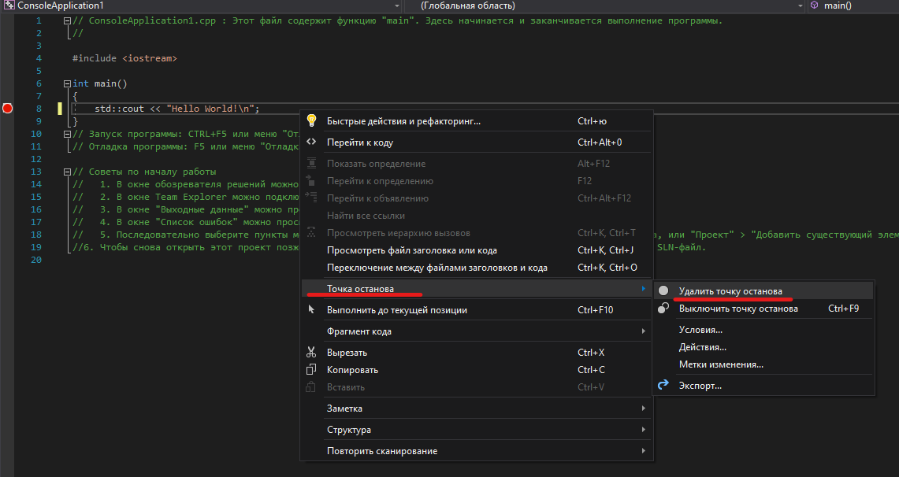

>Рисунок.11 Удаление точки останова

## 9. Создайте программу со следующим кодом:
```c++
     #include <iostream>
	 
 	int main() {
    	int i;
    	i = 5;
    	std::cout << i;
    	return 0;
	}
```
 - Переключитесь в конфигурацию сборки Debug;
 - Установите breakpoint на 5 и 6 строках;
 - Запустите приложение в режиме отладки. Используйте Кнопку Продолжить или Шаг с обходом для перемещения к следующей точке останова;
 - Какое значение содержит переменная i в 5й строке?
 - Какое значение содержит переменная i в 6й строке?
 
### Ответ: в 5й строке перменная i содержит значение **-858993460**, а в 6й перменная i содержит значение **5**.

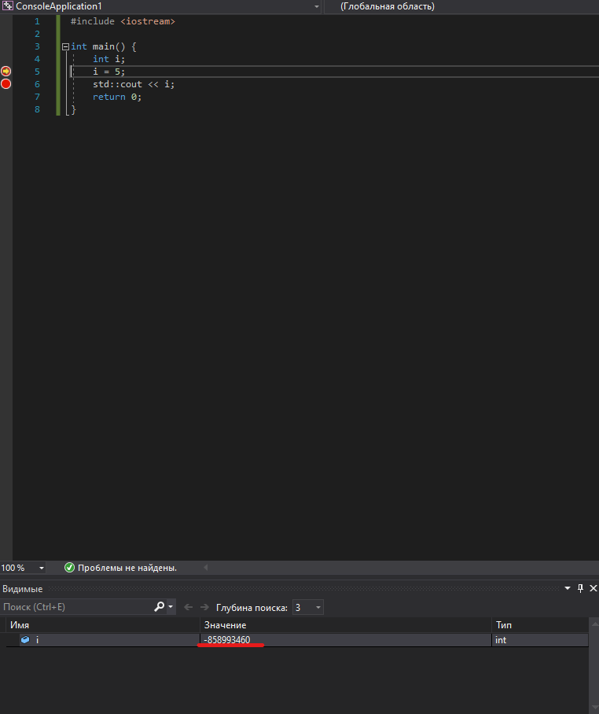

>Рисунок.12 Значение переменной в 5й строке


>Рисунок.13 Значение переменной в 6й строке

## 10. Выполните задание 9 изменив программу на следующую:
```c++
	 #include <iostream>
	 
 	int main() {
    	double i;
    	i = 5;
    	std::cout << i;
    	return 0;
	}
```
### Ответ: в 5й строке перменная i содержит значение **-9.2559631349317831e+61**, а в 6й перменная i содержит значение **5.0000000000000000**.

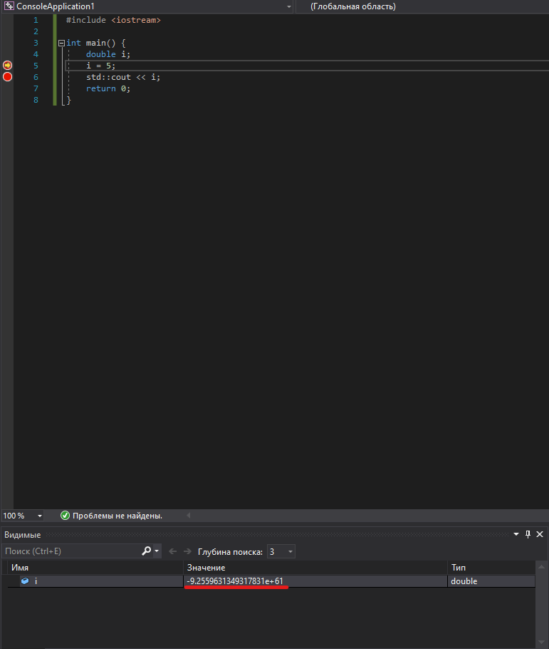

>Рисунок.14 Значение переменной в 5й строке

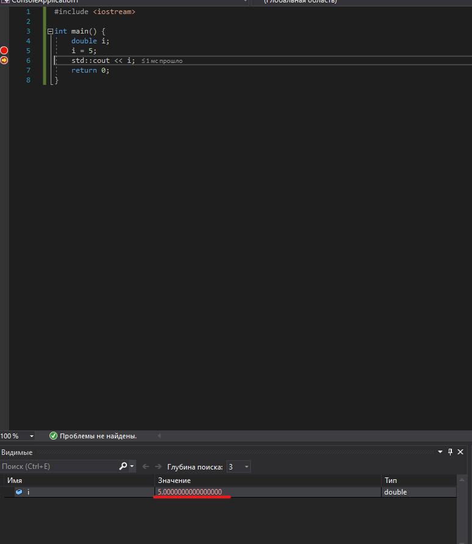

>Рисунок.15 Значение переменной в 6й строке

## Вывод: 
Я изучил базовые возможности MS Visual Studio, а также научился создавать и совершать отладку в IDE MS Visual Studio.
