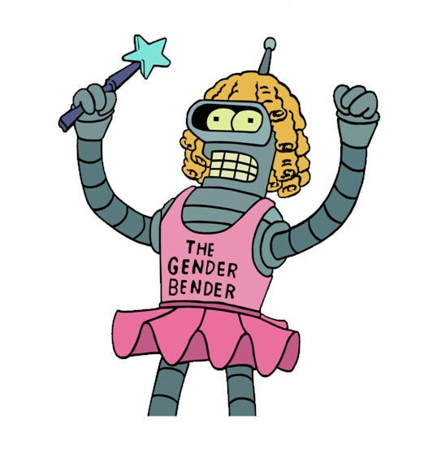
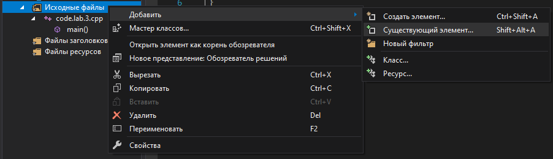
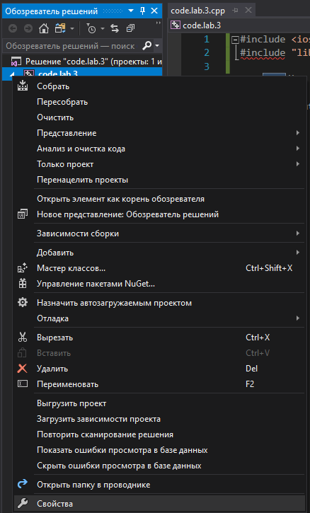
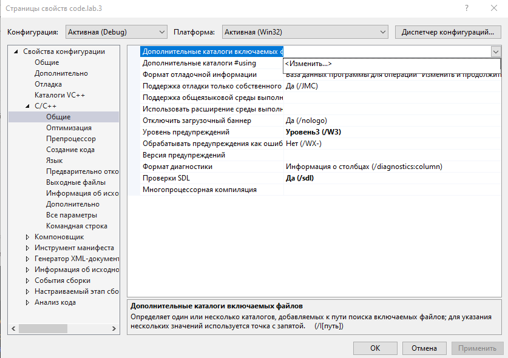
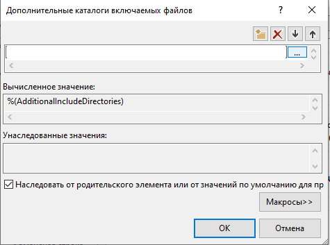
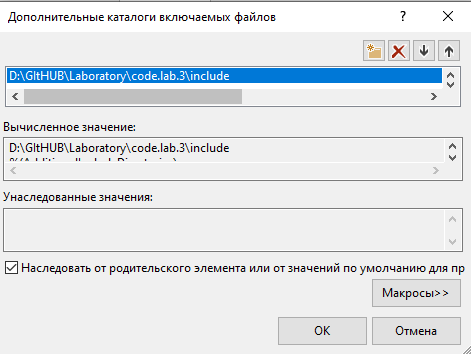
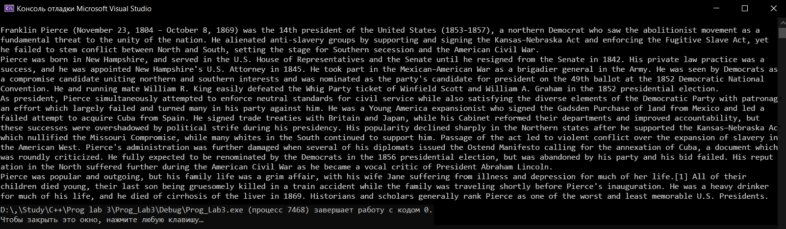

МИНИСТЕРСТВО НАУКИ  И ВЫСШЕГО ОБРАЗОВАНИЯ РОССИЙСКОЙ ФЕДЕРАЦИИ  
Федеральное государственное автономное образовательное учреждение высшего образования  
"КРЫМСКИЙ ФЕДЕРАЛЬНЫЙ УНИВЕРСИТЕТ им. В. И. ВЕРНАДСКОГО"  
ФИЗИКО-ТЕХНИЧЕСКИЙ ИНСТИТУТ  
Кафедра компьютерной инженерии и моделирования
<br/><br/>

### Отчёт по лабораторной работе № 3<br/> по дисциплине "Программирование"
<br/>

студента 1 курса группы ПИ-192(2)  
Ярош Никиты Валерьевича 
направления подготовки 09.03.04 "Программная инженерия"  
<br/>

<table>
<tr><td>Научный руководитель<br/> старший преподаватель кафедры<br/> компьютерной инженерии и моделирования</td>
<td>(оценка)</td>
<td>Чабанов В.В.</td>
</tr>
</table>
<br/><br/>

Симферополь, 2019


# Дешифровка текста из изображения

**Цель:** 
1. Закрепить навыки разработки программ использующих операторы цикла 
2. Закрепить навыки разработки программ использующих массивы
3. освоить методы подключения сторонних библиотек

**Задача:**
Написать на языке C++ программу, которая по заданному изображению и ключу восстанавливает исходное текстовое сообщение зашифрованное в изображение.


>Рисунок.1 Изображение

00g 00b 00r 10g 10b 10r 01g 01b
>Ключ

# Ход работы

1. Я, для того чтобы работать с изображениями в формате **bmp**, скачал библиотеку https://github.com/marc-q/libbmp;
2. Из скаченного репозитория в папке **CPP** лежат файлы, которые я добавил в проект;
3. Добавление файла **libbmp.cpp** *(рис.2)*;

>Рисунок.2 Добавление libbmp.cpp
4. Затем в проекте создал папку **include** в которую скопировал файл **libbmp** из репозитория;
5. В *"Обозреватель решений"* открыл *"Свойства"* *(рис.3)*

>Рисунок.3 Открытие свойств проекта
6. В *"Свойства конфигурации"* открыл вкладку *"С/С++"*, а в ней *"Общие"* > *"Дополнительные каталоги включаемых файлов"* > нажал на стрелочку в конце > *"Изменить"* *(рис.4)*

>Рисунок.4 Свойства проекта
7. В появившемся окне кликнул на иконку с изображением папки, а затем на появившиеся троеточия *(рис.5)*;

>Рисунок.5 Свойства проекта
8. Указал путь к папке **include** *(рис.6)*;

>Рисунок.6 Свойства проекта
9. Подключил библиотеку в свой проект. Для этого я использовал команду :
```c++
#include "libbmp.h"
```
10. Написал код для декодирования изображения: 
```c++
#include <iostream>
#include "libbmp.h"
#include <string>
using namespace std;

enum Channel {
	GREEN,
	BLUE,
  RED
};

int binary_to_int(string t){
	int result = (int)(t[0] - 48) * 128 + (int)(t[1] - 48) * 64 +
		(int)(t[2] - 48) * 32 + (int)(t[3] - 48) * 16 +
		(int)(t[4] - 48) * 8 + (int)(t[5] - 48) * 4 +
		(int)(t[6] - 48) * 2 + (int)(t[7] - 48);
	return result;
}

bool check(string* temp) {
	if (temp->size() == 8) {
		if ((char)binary_to_int(*temp) == '\0') return false;
		cout << (char)binary_to_int(*temp);
		*temp = "";
	}
	return true;
}

bool getChar(BmpImg* img, int x, int y, string* temp, Channel channel ) {
	switch (channel){
	case RED: 
		*temp += ((int)img->green_at(x, y)) % 2 + 48;
		break;
	case GREEN: 
		*temp += ((int)img->blue_at(x, y)) % 2 + 48;
		break;
	case BLUE: 
		*temp += ((int)img->red_at(x, y)) % 2 + 48;
		break;
	}
	if (!check(temp)) return false;
	return true;
}


int main(){
	setlocale(LC_ALL, "Russian");
	BmpImg img;
	img.read("pic2.bmp");
	string temp = "";

	for (int i = 0; i < img.get_height(); i++) {         // KEY  =  00g 00b 00r 10g 10b 10r 01g 01b
		for (int j = 0; j < img.get_width(); j++) {   
			if (!getChar(&img, j, i, &temp, GREEN)) return 1;
			if (!getChar(&img, j, i, &temp, BLUE)) return 2;
			if (!getChar(&img, j, i, &temp, RED)) return 3;
		}
	}

	return 4;
}
```
10. В консоль получил следующее сообщение:

>Рисунок.7 Вывод в консоль

**Вывод:** Я научился работать с дешифровкой изображений формата bmp, а также освоил метод подключения сторонних библиотек.

