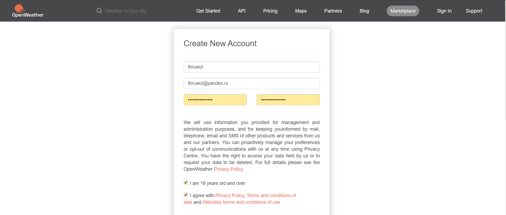
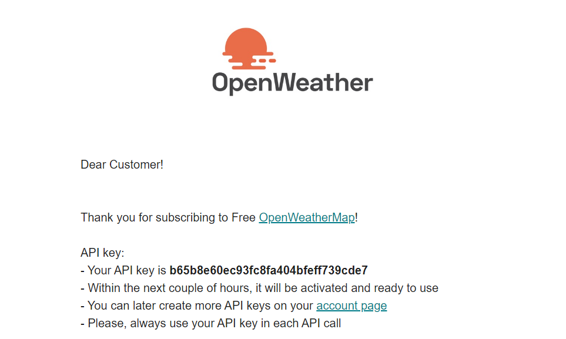

МИНИСТЕРСТВО НАУКИ  И ВЫСШЕГО ОБРАЗОВАНИЯ РОССИЙСКОЙ ФЕДЕРАЦИИ  
Федеральное государственное автономное образовательное учреждение высшего образования  
"КРЫМСКИЙ ФЕДЕРАЛЬНЫЙ УНИВЕРСИТЕТ им. В. И. ВЕРНАДСКОГО"  
ФИЗИКО-ТЕХНИЧЕСКИЙ ИНСТИТУТ  
Кафедра компьютерной инженерии и моделирования
<br/><br/>

### Отчёт по лабораторной работе № 6<br/> по дисциплине "Программирование"
<br/>

студента 1 курса группы ПИ-192(2)  
Ярош Никиты Валерьевича 
направления подготовки 09.03.04 "Программная инженерия"  
<br/>

<table>
<tr><td>Научный руководитель<br/> старший преподаватель кафедры<br/> компьютерной инженерии и моделирования</td>
<td>(оценка)</td>
<td>Чабанов В.В.</td>
</tr>
</table>
<br/><br/>

Симферополь, 2019


# Погодный информер

**Цель**: 
1. Закрепить навыки разработки многофайловыx приложений;
2. Изучить способы работы с API web-сервиса;
3. Изучить процесс сериализации/десериализации данных.

# Ход работы

## 1. скачал [библиотеку](https://github.com/yhirose/cpp-httplib) для работы с сетью;

## 2. Зарегестрировался на сайте [openweathermap](https://openweathermap.org/).


## 3. Получил токен 


## 4. Написал код:
  ```c++
#include <string>
#include <iostream>
#include <httplib/httplib.h>
#include <nlohman/json.hpp>
#include <fstream>

using namespace httplib;
using namespace nlohmann;


std::string PATH = "data/2.5/forecast?q=Dzhankoy,us&mode=xml&appid=b65b8e60ec93fc8fa404bfeff739cde7";


void gen_response(const Request& req, Response& res)
{
	std::ifstream fin("informer_template.html");
	std::string temp;
	std::getline(fin, temp, '\0');

	httplib::Client cli("api.openweathermap.org", 80);

	auto client_res = cli.Get(PATH.c_str());
	if (client_res && client_res->status == 200)
	{
		json j = json::parse(client_res->body);
		std::string forr = "{city.name}";
		temp.replace(temp.find("{city.name}"), forr.size(), j["city"]["name"].get<std::string>());

		size_t last_index = 0;

		std::string storage;
		for (short i = 0; i < j["cnt"].get<short>(); i += 8)
		{
			storage = j["list"][i]["dt_txt"].get<std::string>();
			storage = storage.substr(0, storage.find(' '));
			last_index = temp.find("{list.dt}", last_index);
			temp.replace(last_index, strlen("{list.dt}"), storage);

			storage = j["list"][i]["weather"][0]["icon"].get<std::string>();
			last_index = temp.find("{list.weather.icon}", last_index);
			temp.replace(last_index, strlen("{list.weather.icon}"), storage);

			storage = std::to_string(j["list"][i]["main"]["temp"].get<double>());
			last_index = temp.find("{list.main.temp}", last_index);
			temp.replace(last_index, strlen("{list.main.temp}"), storage.substr(0, 4));
		}

	}

	res.set_content(temp, "text/html");
}

int main()
{
	Server svr;                    // Создаём сервер (пока-что не запущен)
	svr.Get("/", gen_response);    // Вызвать функцию gen_response если кто-то обратиться к корню "сайта"
	svr.listen("localhost", 1234); // Запускаем сервер на localhost и порту 1234	
}
```

## 5. Проверил работу написанного кода в браузере.


**Вывод:** В ходе выполнения данной работы я научился работать с API-сервисом openweathermap, изучил процесс сериализации и десериализации данных.

