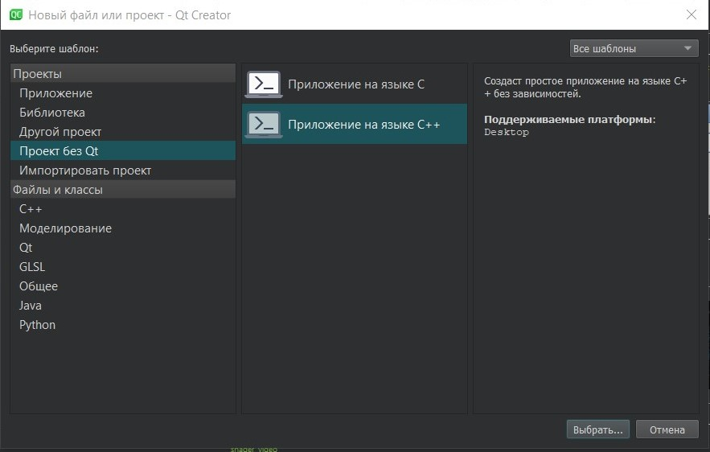

МИНИСТЕРСТВО НАУКИ  И ВЫСШЕГО ОБРАЗОВАНИЯ РОССИЙСКОЙ ФЕДЕРАЦИИ  
Федеральное государственное автономное образовательное учреждение высшего образования  
"КРЫМСКИЙ ФЕДЕРАЛЬНЫЙ УНИВЕРСИТЕТ им. В. И. ВЕРНАДСКОГО"  
ФИЗИКО-ТЕХНИЧЕСКИЙ ИНСТИТУТ  
Кафедра компьютерной инженерии и моделирования
<br/><br/>

### Отчёт по лабораторной работе № 7<br/> по дисциплине "Программирование"
<br/>

студента 1 курса группы ПИ-192(2)  
Ярош Никиты Валерьевича 
направления подготовки 09.03.04 "Программная инженерия"  
<br/>

<table>
<tr><td>Научный руководитель<br/> старший преподаватель кафедры<br/> компьютерной инженерии и моделирования</td>
<td>(оценка)</td>
<td>Чабанов В.В.</td>
</tr>
</table>
<br/><br/>

Симферополь, 2019

# Изучение базовых возможностей IDE Qt Creator

**Цель**:   изучить основные возможности создания и отладки программ в IDE Qt Creator.
# Ход работы

##1. Как создать консольное приложение С++ в IDE Qt Creator без использования компонентов Qt?

 Для создания консольного приложения C++ без базовых компонентов Qt нужно нажать комбинацию клавиш **CTRL+N** и в появившемся окне выбрать шаблон проекта **"Проект без Qt"** и затем указать **"Проект на C++"**.



>Рисунок.1 Создание приложения

##2. Как изменить цветовую схему (оформление) среды?

Для изменения цветовой схемы среды нужно выбрать **Инструменты -> Параметры**


>Рисунок.2 Параметры

И в открывшемся окне выбрать слева **Среда** , в которой можно настроить цветовую схему, язык, шрифт и прочие программные параметры.


>Рисунок.3 Изменение цветовой схемы

##3. к закомментировать/раскомментировать блок кода средствами Qt Creator?

Для комментирования и раскомментирования в Qt Creator используется сочетание клавиш **CTRL+/**. Нужно выделить нужную строку или строки и использовать данную комбинацию клавиш.

##4. Как открыть в проводнике Windows папку с проектом средствами Qt Creator?

Для того, чтобы открыть в Windows файл проекта средствами Qt Creator, надо:
Перейти в папку проекта и нажав правой кнопкой по файлу-проекту выбрать **Открыть с помощью** и выбрать Qt Creator.


>Рисунок.4 Открытие проекта

##5. Какое расширение файла-проекта используется Qt Creator?

 Qt Creator использует расширение проекта *.pro.


>Рисунок.5 Расширение проекта

##6-7. Как запустить код без отладки? Как запустить код в режиме отладки?

Для запуска кода в режиме без отладки и в режиме отладки нужно воспользоваться сочетанием клавиш:
 **CTRL+R** - для запуска когда без отладки или **F5** - для запуска в режиме отладки.
Также можно воспользоваться соответствующими кнопками на боковой панели.


>Рисунок.6 Режимы запуска

##8. Как установить/убрать точку останова (breakpoint)?

Для того, чтобы установить или убрать точку останова, нужно щёлкнуть по строке, на которую нужно поставить/убрать breakpoint и нажать **F9** или щёлкнуть на специальном поле слева.

![поле breakpoint] (Images/7.7.jpg)

>Рисунок.7 Специальное поле breakpoint

##9. Создайте программу со следующим кодом:
```c++
#include <iostream>
int main() {
    int i;
    double d;
    i = 5;
    d = 5;
    std::cout << i << d;
    return 0;
}
```
* Переключитесь в конфигурацию сборки «Отладка»;
* Установите breakpoint на 5, 6 и 7 строках;
* Запустите приложение щелкнув по кнопке с изображением жука .
* Используйте эту же кнопку для перехода к следующей точке останова;
* Какое значение содержит переменная i в 5й строке?
* Какое значение содержит переменная d в 6й строке?
* Какие значение содержатся в переменных i и  d в 7й строке?
* Совпадают ли эти значения с теми, что вы получали в MSVS для соответствующих типов?

Переменная i в 5й строке содержит значение **0**, а d в 6й строке значение **7.154545e-318**.


>Рисунок.8. Значение переменных в 5й и 6й строках

В 7й строке переменная i и d содержат значения **5**.


>Рисунок.9. Значение переменных в7й строке

В MSVS эти переменные имели иные значения, так переменная int имела значение ***-858993460**, а на следующей строке уже **5**, а переменная типа double имела значение **-9.2559631349317831e+6**, а на следующей строке уже **5.0000000000000000**.

##15. В инспекторе проекта выберите файл «main.cpp». В этом файле установите курсор на слово «show» в строке calculator.show(); и нажмите F1. Изучите справочную информацию. Таким же образом можно получить справку по любому объекту/методу/полю доступному в Qt;


>Рисунок.10. Открытие справки

##16. В инспекторе проекта выберите файл «Формы» => «calculatorform.ui» и дважды счёлкните ЛКМ;


>Рисунок.11. Окно дизайна

##17. Вы попали на вкладку «Дизайн». На форме замените английский текст на русский. Пересоберите проект.


>Рисунок.12. Смена языка

**Вывод:** я изучил основные возможности создания и отладки программ в IDE Qt Creator.

