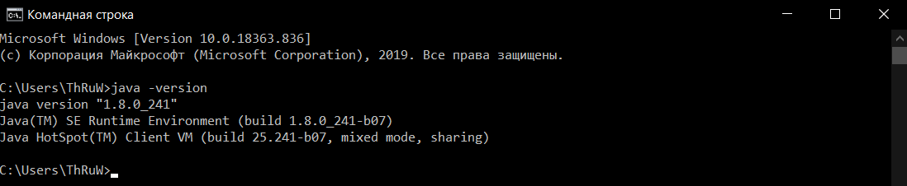

МИНИСТЕРСТВО НАУКИ  И ВЫСШЕГО ОБРАЗОВАНИЯ РОССИЙСКОЙ ФЕДЕРАЦИИ  
Федеральное государственное автономное образовательное учреждение высшего образования  
"КРЫМСКИЙ ФЕДЕРАЛЬНЫЙ УНИВЕРСИТЕТ им. В. И. ВЕРНАДСКОГО"  
ФИЗИКО-ТЕХНИЧЕСКИЙ ИНСТИТУТ  
Кафедра компьютерной инженерии и моделирования
  

### Отчёт по лабораторной работе № 8  по дисциплине "Программирование"
 

студента 1 курса группы ПИ-192(2)  
Ярош Никиты Валерьевича
направления подготовки 09.03.04 "Программная инженерия"  
 

<table>
<tr><td>Научный руководитель  старший преподаватель кафедры  компьютерной инженерии и моделирования</td>
<td>(оценка)</td>
<td>Чабанов В.В.</td>
</tr>
</table>
  

Симферополь, 2019

# Настройка Qt Creator для разработки приложений под android

## Цель:
1. Настроить IDE Qt Creator для разработки приложений под android ОС;
2. Изучить базовые понятия связанные с мобильной разработкой;
3. Научиться создавать мобильные приложения при помощи фреймворка Qt 5.14.

## Ход работы

## 1. Установка JDK 8;

Так как JDK у меня уже был установлен, то я просто удостоверился в том, что версия верная:

>Рисунок.1 Проверка версии JDK

## Вывод:
Я изучил базовые возможности MS Visual Studio, а также научился создавать и совершать отладку в IDE MS Visual Studio.
